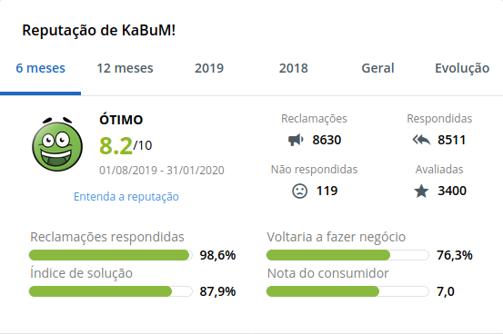

# Consumer Rights

This project was created as a challenge of building a product in a **week** (four hours about five days), passing by the entire process of building a product.

- Chosing the context of the problem we want to focus at.
- Brainstorming which solution could be build and presented that fits the scope time.
- Used techniques like open/close diamond, brainstorming and dead-lines for desitions to avoid waste of time.

The solution that we built it's a web browser plugin that receives information from a website that has informations about complains agains many companies. Based on that information we show the score of that company as an Icon on the Browser. The Icon it's responsable to show if people trust or not the especific website, and based on that. I can take some risks with you want, but you will know if that company has a score, exists and if is trusty.

The project was not completed implemented, only the MVP. The main goal was to create and sell the ideia it self, like a startup business model.

This repository will not be continued.